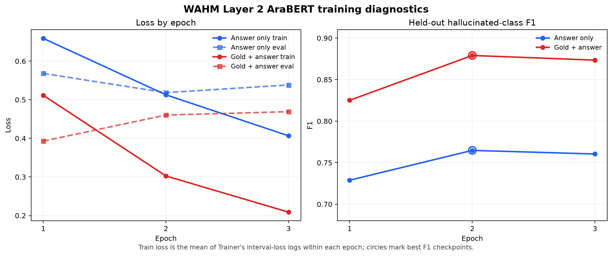

# Layer 2 two-variant AraBERT run

This directory preserves the reviewable outputs from the completed Nautilus
run at commit `c234f9c79a394f1d415314217c93af1326f41e48`. The run used the supplied
`judge_train.csv`, a seed-42 stratified row-random 80/20 split, balanced class
weights, and three epochs for each variant.

## Results

| Variant | Accuracy | Hallucinated F1 | ROC-AUC |
|---|---:|---:|---:|
| Answer only | 0.739 | 0.765 | 0.831 |
| Gold answer + generated answer | 0.861 | 0.879 | 0.932 |

The winning variant is `gold_answer`. Evaluation used `argmax` over the two
class logits, which is equivalent to a hallucination-probability threshold of
`0.5` for inference.

## Epoch diagnostics

`Mean train loss` is the arithmetic mean of the interval losses emitted by
Trainer during that epoch. It is derived from the untouched raw log and is not
presented as an exact full-epoch aggregate.

| Variant | Epoch | Mean train loss | Eval loss | Eval accuracy | Eval F1 | Selected |
|---|---:|---:|---:|---:|---:|:---:|
| Answer only | 1 | 0.658791 | 0.568127 | 0.709178 | 0.728889 | |
| Answer only | 2 | 0.512719 | 0.518377 | 0.738975 | 0.764769 | Yes |
| Answer only | 3 | 0.406519 | 0.538328 | 0.740167 | 0.760440 | |
| Gold + answer | 1 | 0.511532 | 0.392898 | 0.823600 | 0.825059 | |
| Gold + answer | 2 | 0.302576 | 0.460306 | 0.860548 | 0.879007 | Yes |
| Gold + answer | 3 | 0.208881 | 0.469099 | 0.859356 | 0.873391 | |

Both variants show mild overfitting after epoch 2: training loss continues to
fall while evaluation loss rises and held-out F1 slips slightly at epoch 3.
For the gold+answer variant, evaluation loss rises after epoch 1 even though
F1 improves substantially at epoch 2; this can also indicate increasingly
confident errors or weaker probability calibration, not just worse binary
classification. Because checkpoint selection used held-out F1,
`load_best_model_at_end` correctly restored the epoch-2 checkpoint for both
variants. There is no sign of training collapse.

## Preserved files

- `training.log`: full stdout/stderr training record for both variants.
- `training_config.json`: human-readable data, model, optimization, runtime,
  package-version, and artifact-integrity configuration.
- `epoch_metrics.csv`: per-epoch training/evaluation curve values.
- `training_curves.png`: plotted loss and held-out F1 diagnostics.
- `split_manifest.json`: exact train/test row indices and class counts.
- `answer_only_metadata.json`: configuration and full held-out report.
- `gold_answer_metadata.json`: configuration and full held-out report.
- `answer_only_model_config.json` and `gold_answer_model_config.json`: saved
  Transformer architecture configurations.
- `run_summary.json`: final comparison and selected winner.

The final model weights are deliberately not committed to ordinary Git. Their
verified SHA-256 hashes are:

- Answer only: `DDCC2FD38866F22C3607A77EA23B79CBCF5549766162CAF2ED1F10E6D216815F`
- Gold + answer: `57F2D72BAD55CFEBD521DA993E1E38F5FD301BC9AC7A358C546D84CE80F3D81A`

All 19 final deliverables were copied from the Nautilus persistent volume and
verified byte-for-byte with SHA-256 (`19/19`, zero mismatches). The winning
model also passed an independent post-training load and forward-pass test.

## Pipeline smoke test

The preserved winning model was loaded by `score_layer2.py` at the same `0.5`
decision threshold used by the training evaluation. On 128 temporary rows from
the labeled source data, Layer 1 routed 8 as clean, 97 as hallucinated, and 23
to Layer 2. Layer 2 scored exactly those 23 deferred rows, and the combined
pipeline produced all 128 output rows successfully. The combined decisions
matched 107/128 source labels; Layer 2 matched 19/23 among deferred rows.

These figures are a post-training functionality check, not an independent
research result: the smoke rows come from the model's development dataset.
